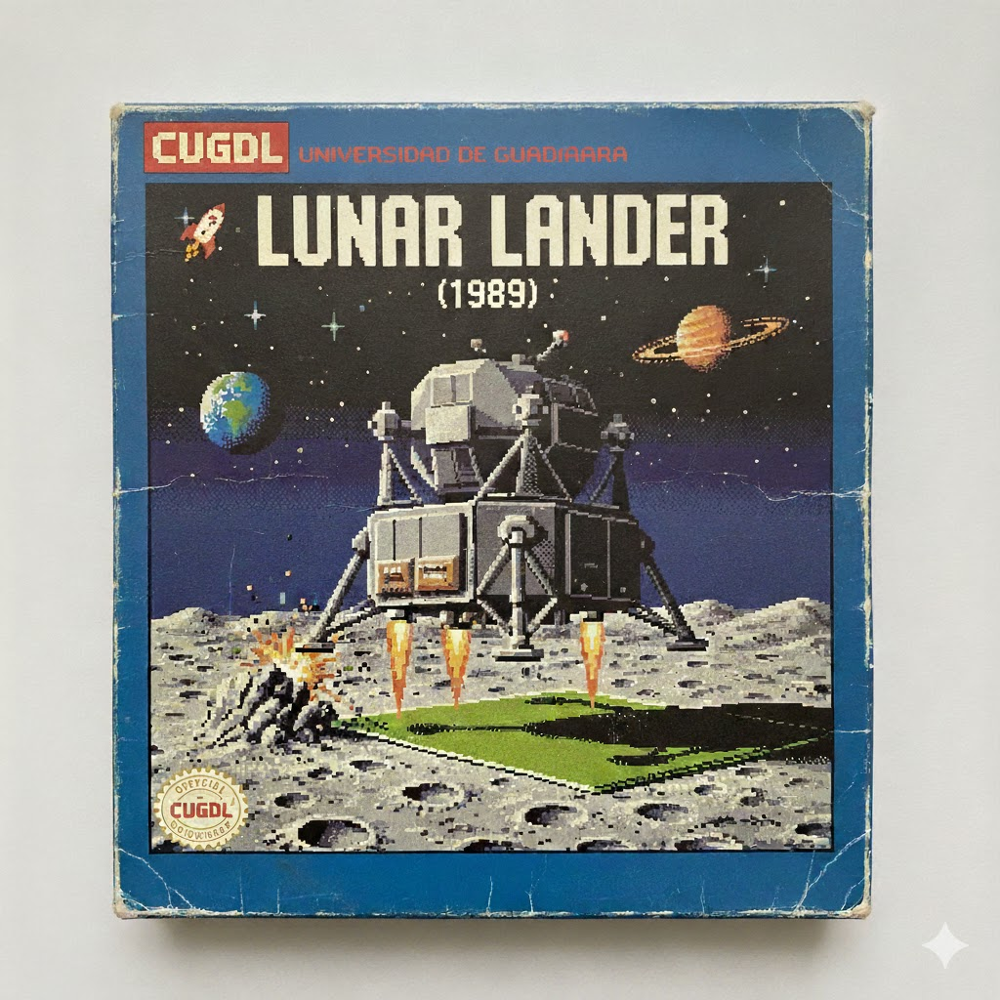

# Lunar Lander


## Créditos de audio
- Música: Pink Floyd - "The Great Gig In The Sky" - Dark Side of the Moon (1973).
- Aviso legal: No soy el poseedor de los derechos de autor de esta obra musical. La música se utiliza sin fines comerciales y únicamente con propósitos educativos.


# Lunar Lander: simulador didáctico de física

## Descripción

**Lunar Lander** es una simulación interactiva que puede utilizarse como recurso didáctico para reforzar contenidos de:

* cinemática;
* dinámica;
* vectores;
* leyes de Newton;
* energía;
* impulso y cantidad de movimiento;
* movimiento angular;
* métodos numéricos;
* modelación computacional.

El programa representa distintas variables físicas relacionadas con el descenso y aterrizaje de un módulo lunar:

* posición;
* velocidad horizontal y vertical;
* gravedad;
* propulsión;
* rotación;
* combustible;
* altitud;
* condiciones para un aterrizaje seguro.

> [!NOTE]
> La simulación constituye un modelo simplificado. Algunas variables se expresan en unidades internas asociadas con los fotogramas de la animación y no necesariamente corresponden de manera directa con unidades físicas reales.

---

## Contenidos físicos que pueden reforzarse

### 1. Cinemática en dos dimensiones

La nave tiene una posición definida por las coordenadas $(x,y)$ y dos componentes de velocidad:

$$
\vec{v} = (v_x,v_y)
$$

En cada fotograma, el programa actualiza la posición de la nave mediante:

$$
x_{n+1}=x_n+v_x
$$

$$
y_{n+1}=y_n+v_y
$$

Estas operaciones aparecen directamente en el código:

```javascript
this.x += this.vx;
this.y += this.vy;
```

A partir de este comportamiento pueden reforzarse los siguientes conceptos:

* posición y desplazamiento;
* rapidez y velocidad;
* componentes horizontal y vertical de la velocidad;
* trayectoria bidimensional;
* interpretación de signos;
* movimiento uniforme horizontal;
* movimiento vertical acelerado.

#### Pregunta para clase

> ¿Por qué la nave puede continuar moviéndose horizontalmente aunque el motor esté apagado?

---

### 2. Caída libre y movimiento uniformemente acelerado

En cada actualización, la gravedad incrementa la componente vertical de la velocidad:

$$
v_{y,n+1}=v_{y,n}+g
$$

En el código se utiliza una constante de gravedad y posteriormente se modifica la velocidad vertical:

```javascript
const gravity = 0.0005;
this.vy += gravity;
```

Este comportamiento permite estudiar las ecuaciones del movimiento uniformemente acelerado:

$$
v_f=v_i+gt
$$

$$
y=y_0+v_0t+\frac{1}{2}gt^2
$$

$$
v_f^2=v_i^2+2g\Delta y
$$

#### Actividad sugerida

Dejar caer la nave sin activar los motores y registrar periódicamente:

* tiempo;
* altitud;
* velocidad vertical;
* aceleración.

Con los resultados pueden construirse las siguientes gráficas:

1. altitud contra tiempo;
2. velocidad vertical contra tiempo;
3. aceleración contra tiempo.

---

### 3. Vectores y descomposición de fuerzas

El empuje depende del ángulo de inclinación de la nave. El programa calcula las componentes horizontal y vertical de la aceleración mediante relaciones trigonométricas:

$$
a_x=a_T\sin(\theta)
$$

$$
a_y=-a_T\cos(\theta)
$$

Estas relaciones están implementadas mediante:

```javascript
Math.sin(this.angle);
Math.cos(this.angle);
```

La simulación permite reforzar:

* magnitudes escalares y vectoriales;
* componentes de un vector;
* funciones seno y coseno;
* suma de vectores;
* dirección y sentido;
* representación gráfica de fuerzas.

Cuando la nave está completamente vertical:

$$
\theta=0^\circ
$$

Por lo tanto:

$$
a_x=0
$$

$$
a_y=-a_T
$$

Cuando la nave se inclina, por ejemplo, un ángulo de $30^\circ$, una parte del empuje actúa en dirección horizontal y puede utilizarse para corregir el desplazamiento lateral.

---

### 4. Segunda ley de Newton

El movimiento de la nave puede analizarse mediante la segunda ley de Newton:

$$
\sum \vec{F}=m\vec{a}
$$

En la dirección vertical:

$$
F_{\mathrm{empuje},y}-mg=ma_y
$$

En la dirección horizontal:

$$
F_{\mathrm{empuje},x}=ma_x
$$

La simulación no calcula explícitamente la fuerza y la masa. En su lugar, modifica directamente las componentes de la velocidad mediante valores de aceleración.

Este aspecto puede utilizarse para que los estudiantes identifiquen la relación entre:

* fuerza;
* masa;
* aceleración;
* gravedad;
* empuje del motor.

#### Posible mejora del simulador

Se podría incorporar una variable de masa:

```javascript
const mass = 1500;
```

Y calcular la aceleración producida por el motor mediante:

$$
a_T=\frac{F_T}{m}
$$

Esto permitiría analizar cómo una misma fuerza produce aceleraciones diferentes dependiendo de la masa de la nave.

---

### 5. Primera ley de Newton e inercia

La nave inicia con una velocidad horizontal distinta de cero:

```javascript
this.vx = 0.5;
```

Cuando no existe una fuerza horizontal neta, esta velocidad permanece aproximadamente constante.

Este comportamiento permite explicar la primera ley de Newton:

> Un cuerpo conserva su estado de reposo o de movimiento rectilíneo uniforme mientras no actúe sobre él una fuerza neta.

La simulación ayuda a corregir la idea de que un objeto necesita mantener encendido su motor para continuar desplazándose.

En ausencia de una fuerza horizontal:

$$
\sum F_x=0
$$

Por lo tanto:

$$
a_x=0
$$

Y la velocidad horizontal permanece constante:

$$
v_x=\text{constante}
$$

---

### 6. Tercera ley de Newton y propulsión

La llama del motor permite introducir el principio de acción y reacción:

* la nave expulsa gases en una dirección;
* los gases ejercen una fuerza sobre la nave en la dirección opuesta.

La relación puede expresarse como:

$$
\vec{F}_{\mathrm{nave\ sobre\ gases}}
=====================================

-\vec{F}_{\mathrm{gases\ sobre\ nave}}
$$

Aunque la simulación no modela de manera explícita la expulsión de masa, su representación visual facilita explicar la tercera ley de Newton.

En un nivel avanzado, este comportamiento puede relacionarse con:

* conservación del momento lineal;
* sistemas de masa variable;
* impulso específico;
* ecuación del cohete.

---

### 7. Movimiento angular

La nave puede rotar hacia la izquierda o hacia la derecha. El ángulo se maneja internamente en radianes y puede convertirse a grados para mostrarlo en la telemetría.

Con esta función pueden reforzarse:

* grados y radianes;
* posición angular;
* sentido horario y antihorario;
* orientación de un cuerpo;
* velocidad angular;
* aceleración angular;
* torque;
* momento de inercia.

Actualmente, el programa modifica directamente el ángulo:

$$
\theta_{n+1}=\theta_n+\Delta\theta
$$

Este modelo no incluye velocidad angular ni inercia rotacional.

#### Posible ampliación

Para crear un modelo más realista podría utilizarse:

$$
\tau=I\alpha
$$

Donde:

* $\tau$ representa el torque;
* $I$ representa el momento de inercia;
* $\alpha$ representa la aceleración angular.

Después, la velocidad angular podría actualizarse mediante:

$$
\omega_{n+1}=\omega_n+\alpha\Delta t
$$

Y la posición angular mediante:

$$
\theta_{n+1}=\theta_n+\omega\Delta t
$$

---

### 8. Impulso y cantidad de movimiento

Cada activación del motor modifica la velocidad de la nave. Este cambio puede interpretarse como un impulso:

$$
\vec{J}=\vec{F}\Delta t
$$

El impulso también equivale al cambio en la cantidad de movimiento:

$$
\vec{J}=\Delta\vec{p}
$$

Y la cantidad de movimiento se define como:

$$
\vec{p}=m\vec{v}
$$

Los estudiantes pueden experimentar con:

* impulsos breves;
* impulsos prolongados;
* correcciones realizadas a gran altitud;
* correcciones cercanas al suelo;
* distintos ángulos de propulsión.

La actividad permite observar que las correcciones pequeñas y anticipadas pueden requerir menos combustible que una corrección intensa realizada poco antes del aterrizaje.

---

### 9. Energía mecánica

Durante el descenso, la energía potencial gravitatoria se transforma progresivamente en energía cinética.

La energía potencial gravitatoria puede representarse mediante:

$$
E_p=mgh
$$

La energía cinética se calcula con:

$$
E_k=\frac{1}{2}mv^2
$$

La energía mecánica total es:

$$
E_m=E_p+E_k
$$

Al encender el motor se incorpora energía procedente del combustible. En caso de impacto, parte de la energía cinética puede transformarse en:

* deformación;
* calor;
* sonido;
* vibración;
* fragmentación.

Debido a que la nave se mueve en dos dimensiones, la magnitud de su velocidad es:

$$
v=\sqrt{v_x^2+v_y^2}
$$

Por lo tanto, la energía cinética antes del contacto puede calcularse mediante:

$$
E_k=\frac{1}{2}m\left(v_x^2+v_y^2\right)
$$

Esta ecuación muestra por qué las velocidades horizontal y vertical son importantes para determinar la seguridad del aterrizaje.

---

### 10. Colisiones y condiciones de aterrizaje

La simulación considera exitoso el aterrizaje cuando se cumplen simultáneamente varias condiciones:

* la nave se encuentra sobre la plataforma;
* la velocidad vertical es menor que el límite establecido;
* la velocidad horizontal es menor que el límite establecido;
* el ángulo de inclinación es menor de $5^\circ$.

El código utiliza límites de `0.4` para las velocidades y de `5°` para la inclinación.

Estas condiciones pueden expresarse como una ventana de aterrizaje seguro:

$$
\left|v_x\right|<v_{x,\max}
$$

$$
\left|v_y\right|<v_{y,\max}
$$

$$
\left|\theta\right|<\theta_{\max}
$$

Para los valores utilizados en la simulación:

$$
\left|v_x\right|<0.4
$$

$$
\left|v_y\right|<0.4
$$

$$
\left|\theta\right|<5^\circ
$$

#### Actividad sugerida

Construir una tabla o diagrama en el que se clasifiquen distintas combinaciones de velocidad y ángulo como:

* aterrizaje seguro;
* aterrizaje riesgoso;
* impacto.

---

### 11. Optimización y administración del combustible

El proyecto incluye una reserva inicial de combustible que disminuye al activar los sistemas de propulsión o rotación.

Esto permite plantear problemas de optimización, por ejemplo:

* aterrizar utilizando la menor cantidad posible de combustible;
* determinar el mejor momento para iniciar el frenado;
* comparar el empuje continuo con pulsos breves;
* equilibrar seguridad y eficiencia;
* calcular la tasa de consumo de combustible;
* evaluar distintas estrategias de descenso.

La tasa media de consumo puede calcularse mediante:

$$
\text{Tasa de consumo}
======================

\frac{\text{combustible utilizado}}{\text{tiempo transcurrido}}
$$

También puede calcularse la eficiencia de una estrategia:

$$
\text{Eficiencia}
=================

\frac{\text{combustible restante}}{\text{combustible inicial}}\times 100
$$

#### Competencia didáctica

Puede organizarse una competencia en la que se consideren:

1. aterrizaje exitoso;
2. menor velocidad de contacto;
3. menor inclinación;
4. mayor cantidad de combustible restante;
5. menor tiempo de descenso.

---

### 12. Modelación matemática y métodos numéricos

Una simulación computacional no siempre resuelve las ecuaciones del movimiento de forma algebraica. En muchos casos, aproxima el comportamiento del sistema mediante pequeños intervalos de tiempo.

La actualización utilizada en este proyecto se aproxima al método de Euler:

$$
v_{n+1}=v_n+a_n\Delta t
$$

$$
x_{n+1}=x_n+v_n\Delta t
$$

Para el movimiento en dos dimensiones:

$$
v_{x,n+1}=v_{x,n}+a_{x,n}\Delta t
$$

$$
v_{y,n+1}=v_{y,n}+a_{y,n}\Delta t
$$

$$
x_{n+1}=x_n+v_{x,n}\Delta t
$$

$$
y_{n+1}=y_n+v_{y,n}\Delta t
$$

Sin embargo, el programa actual no utiliza explícitamente un valor de $\Delta t$. Sus actualizaciones dependen del número y frecuencia de los fotogramas.


